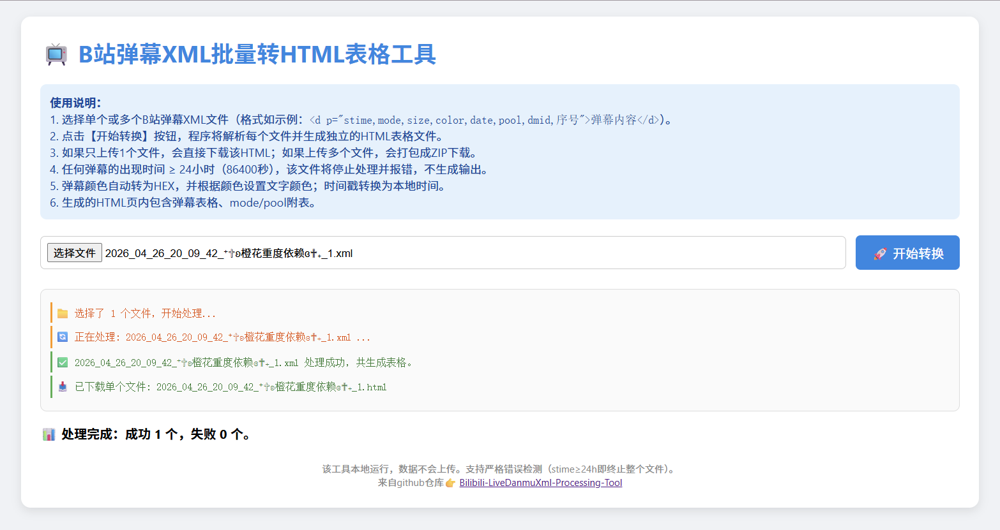
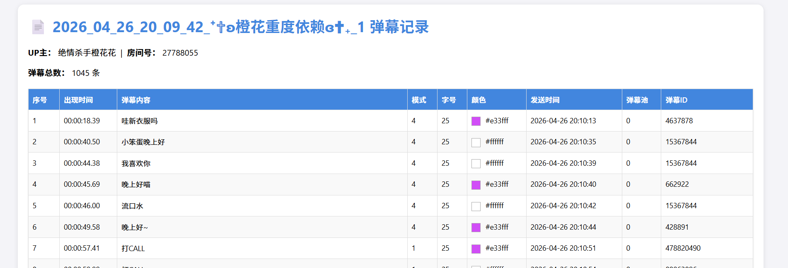

# Bilibili-LiveDanmuXml-Processing-Tool
B站直播xml弹幕文件转换工具，把xml转换成html、ass文件用于查看或在视频中播放弹幕

工具优势：html本地工具，点开即用，极致轻量

本人实际使用场景：  

使用DDTV对某主播进行录制，观看时发现有精彩内容时发送弹幕，录制完成后打开xml查看自己发送的弹幕对应的时间，但xml文件中stime的格式是秒、date是Unix时间戳，无法直接得到发送弹幕对应的时分秒格式的视频时间点和日期+时分秒格式的真实时间，于是想到做个解析转换工具~

# XML 转 HTML

使用浏览器打开html工具如下图

xml转换为html后如下图所示

# XML 转 ASS

待开发……

# Reference

若有使用问题b站私信我能最快得到回复👉：[@JKY](https://space.bilibili.com/1055768998)

## 📖 xml解析参考：   
[B站xml弹幕内容详解-xml标头](https://www.bilibili.com/read/cv22390715)  
[B站xml弹幕内容详解 普通弹幕篇](https://www.bilibili.com/read/cv22390708)

## 其它弹幕文件处理工具

[录播姬-其它工具和项目](https://rec.danmuji.org/user/other-projects/)

| 名字                      | 链接                                                         | 功能            | 备注说明                                            |
| ------------------------- | ------------------------------------------------------------ | --------------- | --------------------------------------------------- |
| DanmakuFactory            | [GitHub 项目页](https://github.com/hihkm/DanmakuFactory#windows) | 转换为 ASS 字幕 | 支持转换录播姬弹幕 XML 的 礼物、舰长购买、SuperChat |
| Hami-Lemon/converter      | [GitHub 项目页](https://github.com/Hami-Lemon/converter)     | 转换为 ASS 字幕 |                                                     |
| gwy15/danmu2ass           | [GitHub 项目页](https://github.com/gwy15/danmu2ass)          | 转换为 ASS 字幕 |                                                     |
| 弹幕盒子                  | [GitHub Pages](https://danmubox.github.io/) [Gitee 镜像](https://danmubox.gitee.io/) | 转换为 ASS 字幕 | 无需下载，浏览器内操作                              |
| bilibili ASS 弹幕在线转换 | [GitHub Pages](https://tiansh.github.io/us-danmaku/bilibili/) | 转换为 ASS 字幕 | 无需                                                |